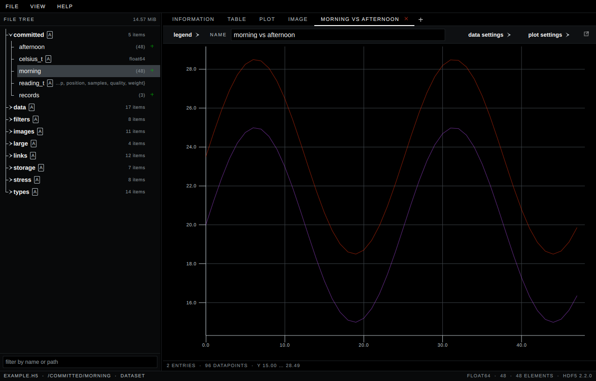

# H5Scope

[](https://github.com/jonassattler/H5Scope/actions/workflows/ci.yml)

A featureful and performant HDF5 viewer. Written in C++ and based on Qt.

## Features

- Inspect the structure of HDF5 files, including metadata and attributes
- Search through complex HDF5 files with wildcards
- Visualize datasets as spreadsheets, plots or images
- Draw slices of several datasets together on one pair of axes, against the
  index, a stated range, or another dataset read as a time series
- View images, which are automatically detected based on the HDF5 specification
- Work with high dimensional arrays by utilizing powerful slicing tools
- Transpose, reshape, reduce and slice a dataset before you look at it, with a
  pipeline whose operations are numpy's
- Modern and responsive Qt based user interface

Files are opened read-only. H5Scope never writes to the file it is showing.

## Screenshots

The Information tab — everything HDF5 records about the selected object, down
to its attributes.


The Plot view, with the slice it is drawing spelled out above it.


A custom plot — as many tabs as you like, each holding lines from anywhere in
the file. Datasets go in with the green plus beside them in the tree or from a
right-click, entries can be written out by hand, and a tab can be torn off into
a window of its own so two of them sit side by side.



The Image view — datasets that follow the HDF5 image specification are detected
and shown as images, alpha included.


## Installing

Every release ships self-contained builds for Linux and Windows on x86-64. Qt,
HDF5 and the C++ runtime are linked statically into each of them, so there is
nothing to install and no runtime to match.

### Linux

**The AppImage** is the one to take if you are unsure. It brings a desktop
entry, an icon and an association with `.h5` files.

```sh
chmod +x H5Scope-<version>-x86_64.AppImage
./H5Scope-<version>-x86_64.AppImage
```

**The bare executable** is one file and nothing else.

```sh
chmod +x H5Scope-<version>
./H5Scope-<version>
```

Both are compiled against glibc 2.28, so they run on RHEL 8 and anything newer.

### Windows

**`H5Scope-<version>.exe`** is one file and nothing else. The Visual C++
runtime is linked in with everything else, so there is no redistributable to
install.

It is not code-signed. On first run SmartScreen will say "Windows protected
your PC": choose *More info*, then *Run anyway*. `SHA256SUMS` on the release
page is how to check you have the file the build actually produced.

```powershell
Get-FileHash H5Scope-<version>.exe -Algorithm SHA256
```

`--version`, `--help`, `--license` and `--notices` print to the console when
the program is started from one. Windows does not wait for a windowed program,
so the shell prompt comes back first and the text arrives underneath it; pipe
or redirect it to read it comfortably.

```powershell
.\H5Scope-<version>.exe --license > terms.txt
```

## Building

Requirements everywhere: CMake 3.26 or newer, Ninja, a C++20 compiler, and
[vcpkg](https://github.com/microsoft/vcpkg) with `VCPKG_ROOT` set.

### Linux

Qt also needs the X11 and OpenGL development packages from the system package
manager. On Debian and Ubuntu:

```sh
sudo apt-get install '^libxcb.*-dev' libx11-xcb-dev libglu1-mesa-dev \
    libxrender-dev libxi-dev libxkbcommon-dev libxkbcommon-x11-dev \
    libegl1-mesa-dev
```

Then:

```sh
export VCPKG_ROOT=/path/to/vcpkg
cmake --preset release        # or debug
cmake --build --preset release
ctest --preset release
```

### Windows

Visual Studio 2022 with the *Desktop development with C++* workload. The
presets use Ninja, which expects the compiler to be on the environment already,
so run these from an **x64 Native Tools Command Prompt** rather than an
ordinary one:

```powershell
$env:VCPKG_ROOT = "C:\v"
cmake --preset windows-release   # or windows-debug
cmake --build --preset windows-release
ctest --preset windows-release
```

Keep both the vcpkg checkout and this repository at short paths — `C:\v` and
`C:\src\H5Scope` rather than anything under `Documents`. Qt's artefacts are
the deepest this project produces and the first to run into `MAX_PATH`: its
FluentWinUI3 style plugin alone contributes a 225-character resource object
name, so a long prefix is what decides whether the link succeeds. The failure
does not say so — it is `LNK1181: cannot open input file`, naming a file that
is there.

If the source has to live somewhere long, put the installed tree elsewhere
instead:

```powershell
cmake --preset windows-release -DVCPKG_INSTALLED_DIR=C:\i
```

### Either way

The first configure builds Qt and HDF5 from source and takes hours; every later
one reads vcpkg's binary cache and takes seconds.

[docs/BUILDING.md](docs/BUILDING.md) covers the release builds on both
platforms, the AppImage and the source bundle.

## Contributing

Contributions are welcome, open an issue or a pull request. Pull requests run
the same CI as `main`: the design-token checks, a full build and the complete
test suite.

## License

GPL-3.0-only. See [LICENSE](LICENSE) for the full text. The libraries linked
into the binary and their licences are listed in
[THIRD-PARTY-NOTICES.md](THIRD-PARTY-NOTICES.md), and every release attaches
the complete corresponding source.

"HDF" and "HDF5" are trademarks of The HDF Group. This project is not
affiliated with or endorsed by them.

## Libraries

Everything is built and version-pinned by vcpkg; no system library is used.

| Library | What it is for |
|---|---|
| [Qt](https://www.qt.io/) 6.11.1 | the whole UI, as Qt Quick/QML, plus Qt Graphs for the plot |
| [HDF5](https://www.hdfgroup.org/solutions/hdf5/) 2.2.0 | reading the files |
| [Catch2](https://github.com/catchorg/Catch2) 3.15.3 | the C++ test suites |
| [IBM Plex](https://www.ibm.com/plex/) | the two typefaces, compiled into the binary |
