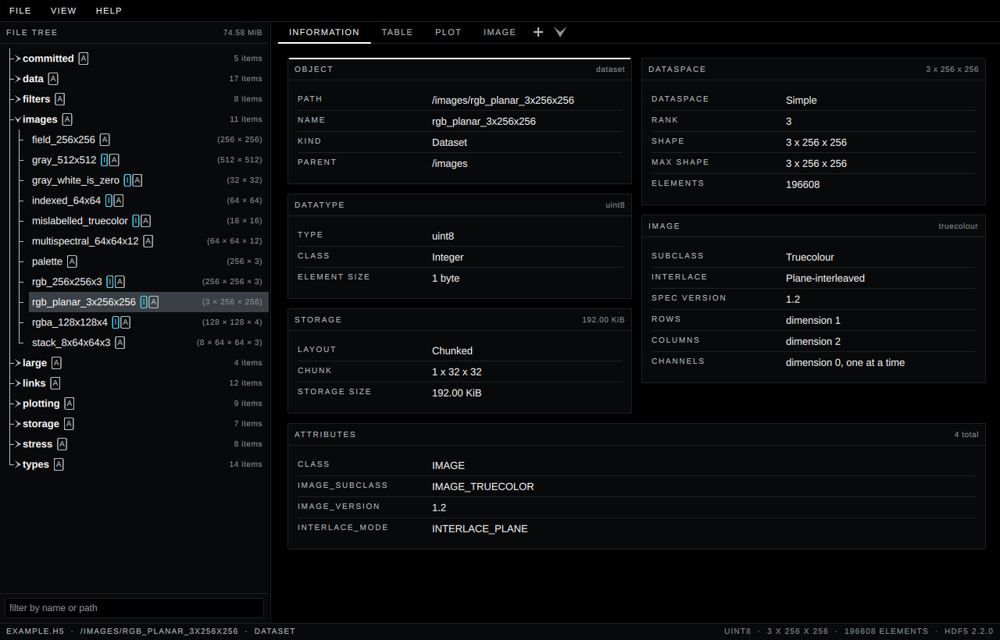
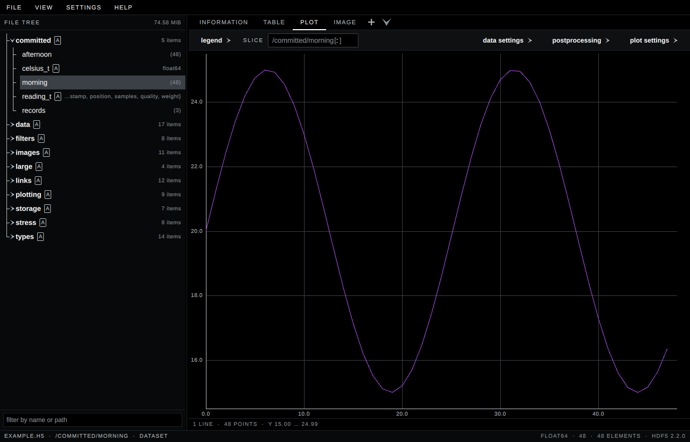
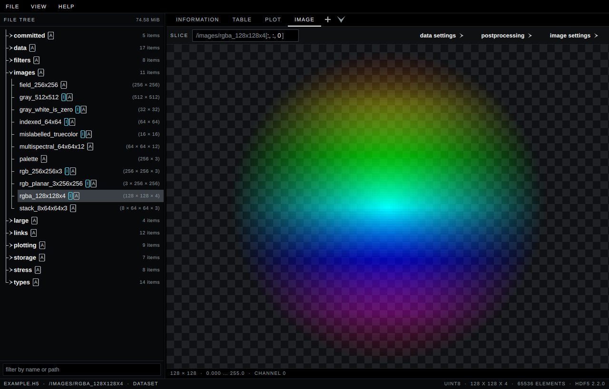

# H5Scope

[](https://github.com/jonassattler/H5Scope/actions/workflows/ci.yml)

A featureful and performant HDF5 viewer. Written in C++ and based on Qt.

## Features

- Inspect the structure of HDF5 files, including metadata and attributes
- Search through complex HDF5 files with wildcards, with the matched
  characters marked and the tree opened to what was found
- Visualize datasets as spreadsheets, plots or images
- View images, which are automatically detected based on the HDF5 specification
- Work with high dimensional arrays by utilizing powerful slicing tools
- Transpose, reshape, reduce and slice a dataset before you look at it, with a
  pipeline whose operations are numpy's
- Modern and responsive Qt based user interface

Files are opened read-only. H5Scope never writes to the file it is showing.

## Screenshots

The Information tab — everything HDF5 records about the selected object, down
to its attributes.



The Plot view, with the slice it is drawing spelled out above it.



The Image view — datasets that follow the HDF5 image specification are detected
and shown as images, alpha included.



## Installing

Every release ships a self-contained build for Linux on x86-64. Qt, HDF5 and
the C++ runtime are linked statically, so there is nothing to install and no
runtime to match.

**The AppImage** is the one to take if you are unsure. It brings a desktop
entry, an icon and an association with `.h5` files.

```sh
chmod +x H5Scope-<version>-x86_64.AppImage
./H5Scope-<version>-x86_64.AppImage
```

**The bare executable** is one file and nothing else.

```sh
chmod +x H5Scope-<version>
./H5Scope-<version>
```
## Building

Requirements: CMake 3.26 or newer, Ninja, a C++20 compiler, and
[vcpkg](https://github.com/microsoft/vcpkg) with `VCPKG_ROOT` exported. Qt also
needs the X11 and OpenGL development packages from the system package manager.
On Debian and Ubuntu:

```sh
sudo apt-get install '^libxcb.*-dev' libx11-xcb-dev libglu1-mesa-dev \
    libxrender-dev libxi-dev libxkbcommon-dev libxkbcommon-x11-dev \
    libegl1-mesa-dev
```

Then:

```sh
export VCPKG_ROOT=/path/to/vcpkg
cmake --preset release        # or debug
cmake --build --preset release
ctest --preset release
```

The first configure builds Qt and HDF5 from source and takes hours; every later
one reads vcpkg's binary cache and takes seconds.

[docs/BUILDING.md](docs/BUILDING.md) covers the release build, the AppImage and
the source bundle.

## Contributing

Contributions are welcome, open an issue or a pull request. Pull requests run
the same CI as `main`: the design-token checks, a full build and the complete
test suite.

## License

GPL-3.0-only. See [LICENSE](LICENSE) for the full text. The libraries linked
into the binary and their licences are listed in
[THIRD-PARTY-NOTICES.md](THIRD-PARTY-NOTICES.md), and every release attaches
the complete corresponding source.

"HDF" and "HDF5" are trademarks of The HDF Group. This project is not
affiliated with or endorsed by them.

## Libraries

Everything is built and version-pinned by vcpkg; no system library is used.

| Library | What it is for |
|---|---|
| [Qt](https://www.qt.io/) 6.11.1 | the whole UI, as Qt Quick/QML, plus Qt Graphs for the plot |
| [HDF5](https://www.hdfgroup.org/solutions/hdf5/) 2.2.0 | reading the files |
| [Catch2](https://github.com/catchorg/Catch2) 3.15.3 | the C++ test suites |
| [IBM Plex](https://www.ibm.com/plex/) | the two typefaces, compiled into the binary |
